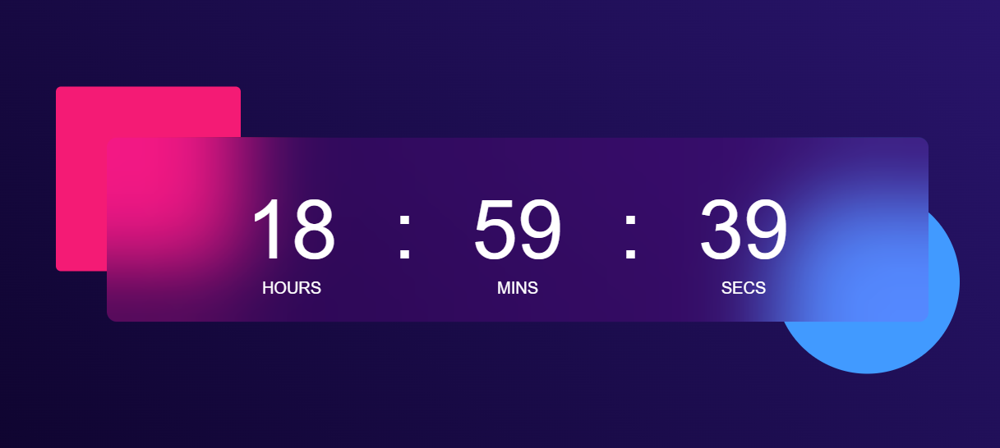

# ⏰ Digital Clock

A simple and responsive Digital Clock built using HTML, CSS, and JavaScript. The clock displays the current hours, minutes, and seconds in real-time with a modern glassmorphism UI design.

## 📸 Screenshot



## 🚀 Features

- Real-time clock updates every second
- Displays Hours, Minutes, and Seconds
- Leading zero formatting (e.g., 08:05:09)
- Glassmorphism effect
- Responsive design
- Attractive gradient background

## 🛠️ Technologies Used

- HTML5
- CSS3
- JavaScript (ES6)

## 📂 Project Structure

```
Digital-Clock/
│
├── index.html
├── style.css
├── script.js
└── README.md
```

## 📸 Screenshot

Add your project screenshot here.

Example:

```
screenshots/digital-clock.png
```

## ⚙️ How It Works

1. JavaScript fetches the current system time using the `Date()` object.
2. The `setInterval()` function updates the clock every second.
3. Hours, minutes, and seconds are displayed dynamically in the browser.
4. Leading zeros are added for single-digit values.

## ▶️ Run Locally

1. Clone the repository

```bash
git clone https://github.com/your-username/Digital-Clock.git
```

2. Navigate to the project folder

```bash
cd Digital-Clock
```

3. Open `index.html` in your browser.

## 📚 Concepts Used

- DOM Manipulation
- Date Object
- setInterval()
- CSS Flexbox
- CSS Pseudo Elements
- Glassmorphism Design

## 🎯 Future Improvements

- 12-Hour Format with AM/PM
- Display Current Date
- Multiple Time Zones
- Dark/Light Theme Toggle

## 👩‍💻 Author

Sneha Dani

GitHub: https://github.com/snehadani635